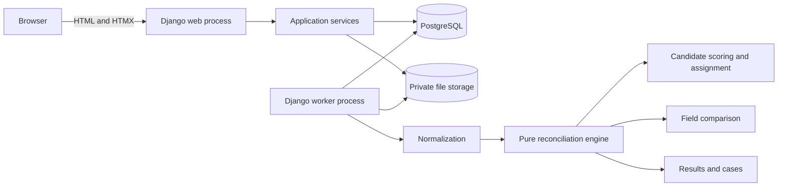
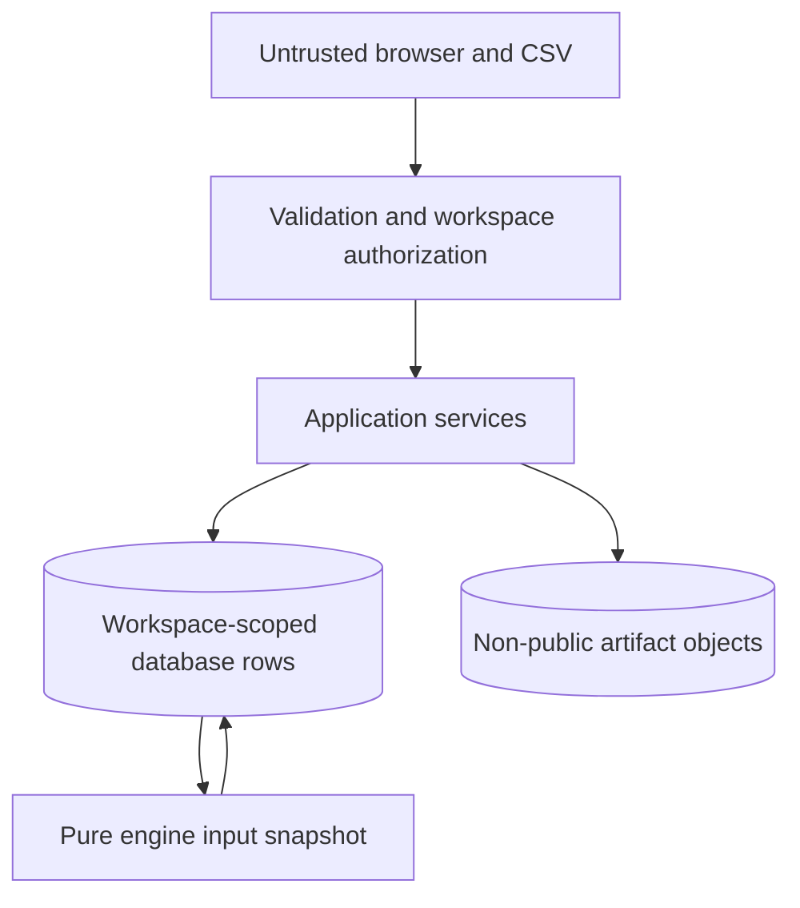
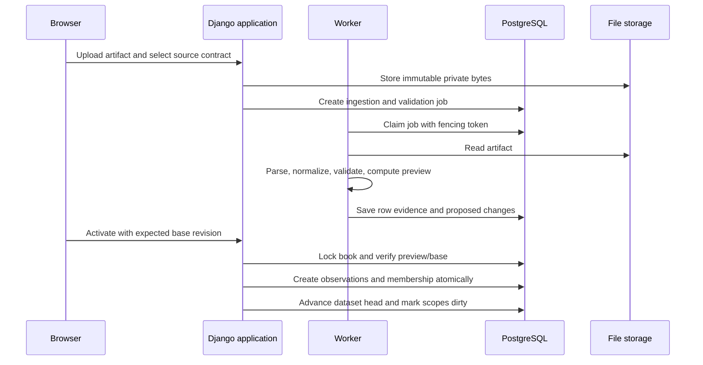
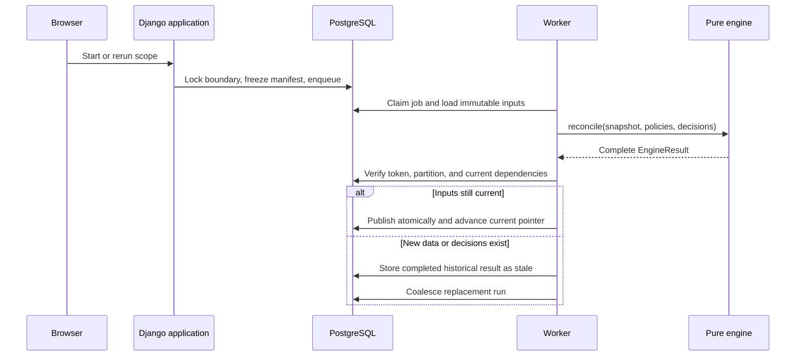
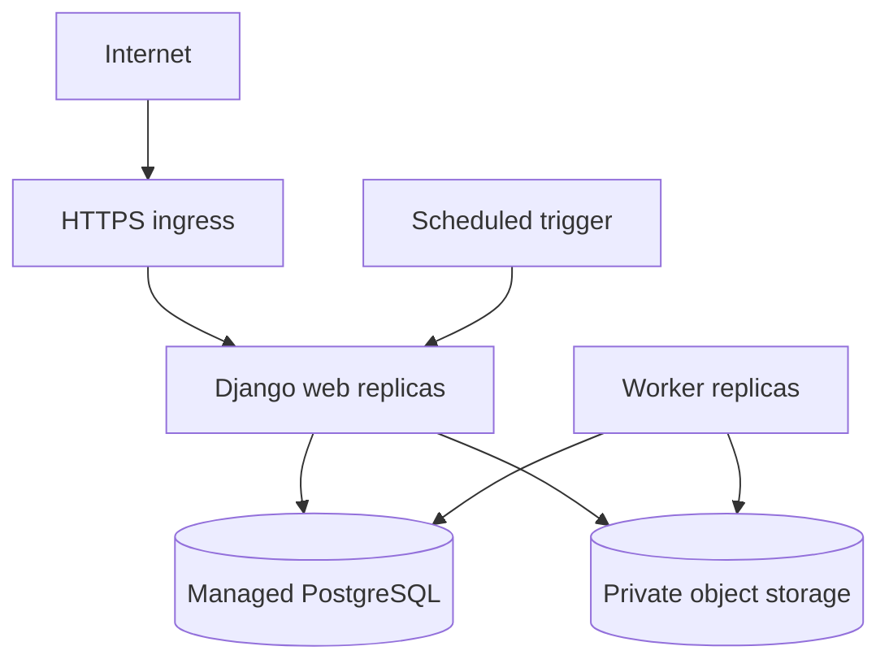

# High-Level Design

## 1. Architecture objective

I use an append-only modular monolith: one codebase and database with strong internal boundaries, deployed as a web process and a worker process. This preserves transactional integrity and local simplicity while keeping the reconciliation engine independent of Django and PostgreSQL.

## 2. Architectural layers

| Layer | Responsibility |
|---|---|
| Presentation | Full pages, HTMX fragments, forms, accessibility, exports |
| Application | Workflows, authorization, transactions, orchestration, publication |
| Domain | Canonical values, matching, assignment, comparison, decision health |
| Persistence | Django repositories, constraints, migrations, query projections |
| Infrastructure | PostgreSQL, private files, worker, metrics, deployment |

The dependency direction points inward. Domain code does not import web, database, file-storage, or job types.

## 3. Main modules

| Module | Responsibility |
|---|---|
| workspaces | Resolve anonymous access, quotas, expiry, and deletion |
| sources | Version source mappings and import contracts |
| ingestion | Store evidence, build previews, deduplicate, activate revisions |
| books | Own source/account pairs, dated scopes, and generation counters |
| reconciliation | Freeze inputs, run the engine, validate and publish results |
| resolutions | Append manual decisions and maintain endpoint reservations |
| cases | Stable case identity, run occurrences, lineage, and current projections |
| jobs | Claim, heartbeat, retry, and fence asynchronous work |
| web | Pages, fragments, forms, downloads, and exports |
| domain | Framework-independent normalization, matching, assignment, comparison |

## 4. Trust boundaries

- CSV contents, filenames, identifiers, and displayed strings are untrusted.
- The anonymous session grants access only to one workspace.
- Object IDs are not authorization tokens.
- Every query, mutation, export, download, and job carries workspace scope.
- Storage keys are generated internally and never derived from filenames.
- Uploaded strings are escaped in HTML and protected against spreadsheet formulas in CSV exports.
- User mappings choose allowlisted transformations; they cannot execute code.

## 5. Reconciliation boundaries

A **reconciliation book** is the long-lived pairing of two source/account identities. Durable decisions and stable cases belong to the book so they can survive daily periods.

A **scope** selects dated dataset identities and coverage within a book. It owns the current result pointer for that period.

A **run** freezes exact dataset revisions, observations, policy revisions, decisions, and engine versions. It never searches across the entire workspace.

This separation prevents two problems:

- A decision tied only to yesterday's dated run would not survive tomorrow.
- Two independently current date scopes would overwrite one book-wide case state in completion order.

## 6. Import flow

A rejected import may preserve raw evidence and error information, but it activates no partial dataset. A failed upload on one side does not remove an already valid dataset on the other.

## 7. Reconciliation run flow

Long computation occurs outside a database transaction. Only input capture and publication use short transactions.

## 8. Consistency model

- Original artifacts, observations, dataset revisions, policy revisions, run inputs, and completed run facts are immutable.
- Mutable pointers identify current dataset revisions and the current run per scope.
- A book generation changes with effective dataset or policy changes.
- A resolution generation changes with effective reviewer decisions.
- Run freshness is independent of run completion. A run can be completed and stale.
- A worker may publish only with its current attempt's fencing token.
- A late older run cannot replace the result for newer inputs.
- Manual decision creation reserves all affected endpoints in one transaction.

## 9. Worker model

The first release uses PostgreSQL-backed work items instead of another queue product.

- Workers claim available records using short row locks.
- Each attempt gets a unique token and renewable lease.
- Expired leases allow another attempt to retry.
- Publication rechecks the attempt token.
- Transient failures retry to a documented limit.
- Each failure and retry remains inspectable.
- An expired workspace does not accept new scheduled work.

A daily scheduler, if included, invokes the same run-creation service as the manual button. A unique scope/local-date key prevents duplicate schedules.

## 10. Deployment model

One versioned image runs different web and worker commands. Local development uses Docker Compose with PostgreSQL and persistent volumes. Deployment uses managed PostgreSQL and private object storage. Migrations execute once as a release step.

Health reporting separates web readiness, database reachability, and worker heartbeat. Logs include workspace/book/scope/run/import/job IDs and stage durations without raw financial rows or session secrets.

## 11. Scaling path

The initial system fully recomputes an affected scope because correctness and reproducibility matter more than incremental cleverness.

Growth path:

1. Index observations by book source, instrument, side, currency, and time.
2. Partition matching by independent candidate-graph components.
3. Tighten or add unioned blocking rules based on measured candidate recall.
4. Reconcile only scopes whose heads or decisions changed.
5. Partition large historical tables by business period when measurements require it.
6. Extract a service only after independent scaling or ownership makes a process boundary valuable.

Streaming systems and microservices are not assumptions in the initial design.

## 12. High-level failure behavior

| Failure | System behavior |
|---|---|
| Bad input | Preserve explanation; do not activate dataset |
| Duplicate or replay | Return earlier import; do not roll back current head |
| Concurrent activation | Reject stale preview and rebuild it |
| Ambiguous candidate graph | Abstain and create review case |
| Worker failure | Retain last successful result and safely retry |
| Mid-run input change | Preserve finished run as stale; compute current manifest |
| Publication failure | No partial completed result or current pointer update |
| Workspace expiry | Revoke access before asynchronous cleanup |

## 13. Quality attributes

| Attribute | Design response |
|---|---|
| Correctness | Frozen inputs, exact decimals, one-to-one constraints, atomic publication |
| Explainability | Versioned evidence vectors, rule IDs, alternative assignment diagnostics |
| Auditability | Immutable source and run history, append-only decisions |
| Security | Session workspace boundary, private files, CSRF, output escaping |
| Reliability | Idempotent imports/runs, leases, fencing, retries, stale protection |
| Maintainability | Modular monolith, pure engine, source adapters, versioned policies |
| Performance | Indexed blocking, connected components, asynchronous execution, explicit caps |
