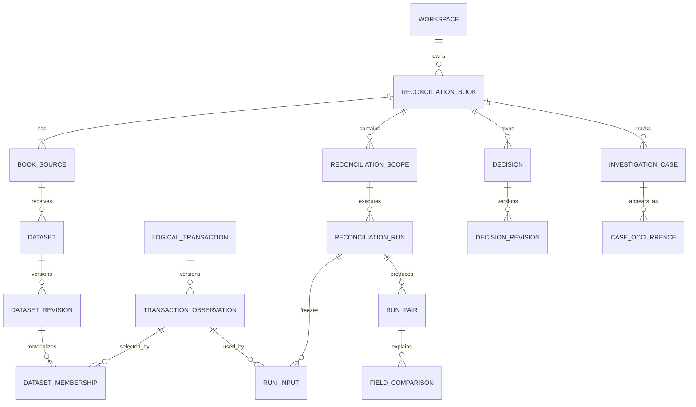

# Low-Level Design

## 1. Domain terminology

| Term | Definition |
|---|---|
| Workspace | Anonymous, session-authorized container for all user data |
| Reconciliation book | Long-lived relationship between two source/account identities |
| Dataset | Stable statement identity for one source and declared coverage |
| Dataset revision | Immutable materialized membership after a full snapshot or delta |
| Logical transaction | Stable source-side identity across corrections |
| Observation | Immutable canonical version of what a source claimed |
| Run | Immutable execution over exact input and policy revisions |
| Pair | Assertion that one left and one right observation describe the same transaction |
| Decision | Durable reviewer authority such as manual link or accept unmatched |
| Case | Stable investigation identity across run occurrences |

## 2. Relational model

Every domain object is owned by a workspace directly or through a constrained parent. Composite foreign keys should enforce common ownership where practical.

| Entity | Essential fields |
|---|---|
| `workspace` | id, session_digest, created_at, last_active_at, expires_at, state, quota counters |
| `source_system` | id, workspace_id, name, source type |
| `mapping_revision` | id, source_id, revision, immutable mapping JSON, parser version, digest |
| `source_contract_revision` | id, source_id, mapping_revision_id, mode, timezone, identity namespace, reference semantics |
| `reconciliation_book` | id, workspace_id, name, generation, resolution_generation |
| `book_source` | id, book_id, LEFT/RIGHT role, source_id, account key, identity namespace |
| `dataset` | id, book_source_id, coverage key, statement key, current_revision_id |
| `file_artifact` | id, workspace_id, physical hash, private storage key, original name, size |
| `ingestion_attempt` | id, artifact_id, dataset_id, contract_revision_id, expected base, semantic hash, state |
| `raw_row` | id, ingestion_id, row number, original values, validation result |
| `logical_transaction` | id, book_source_id, source record key |
| `transaction_observation` | id, logical_transaction_id, canonical values, raw_row_id, fingerprint |
| `dataset_revision` | id, dataset_id, parent_revision_id, ingestion_id, state hash, created_at |
| `dataset_membership` | dataset_revision_id, logical_transaction_id, observation_id |
| `reconciliation_scope` | id, book_id, coverage, left/right dataset IDs, current_run_id, dirty state |
| `policy_revision` | id, book_id, revision, immutable matching/comparison policy, digest |
| `decision` | id, book_id, type, current_revision_id |
| `decision_revision` | id, decision_id, predecessor_id, endpoints, action, reason, reviewed observations |
| `active_decision_claim` | book_id, logical_transaction_id, decision_revision_id |
| `reconciliation_run` | id, scope_id, manifest hash, versions, lifecycle, freshness, timestamps |
| `run_input` | run_id, side, logical_transaction_id, observation_id |
| `run_decision_input` | run_id, decision_revision_id |
| `candidate_evidence` | run_id, left/right observations, component, features, score, flags |
| `assignment_component` | run_id, graph digest, objective, limits, ambiguity diagnostics |
| `run_pair` | run_id, left/right observations, origin, score, global gap |
| `field_comparison` | pair_id, field, source values, differences, tolerance, outcome |
| `run_unpaired` | run_id, observation_id, classification, explanation |
| `investigation_case` | id, book_id, stable key, logical endpoints, lineage |
| `case_occurrence` | case_id, run_id, referenced result, state in run |
| `case_scope_projection` | case_id, scope_id, current occurrence, current review state, generation |
| `audit_event` | book_id, entity references, actor, action, details, timestamp |
| `work_item` | id, target, kind, state, available_at, lease_until, current token |
| `job_attempt` | work_item_id, token, start/end, outcome, error category |



## 3. Database invariants

- `book_source(book_id, role)` is unique.
- `logical_transaction(book_source_id, source_record_key)` is unique.
- `dataset_membership(dataset_revision_id, logical_transaction_id)` is unique.
- A membership's observation belongs to the stated logical transaction.
- `active_decision_claim(book_id, logical_transaction_id)` is unique.
- Manual-link endpoints occupy two claims; accept-unmatched occupies one; rejection occupies none.
- Separate unique constraints prevent reuse of a left or right observation in `run_pair` for one run.
- A result validator proves every eligible input has exactly one terminal outcome: paired once or unpaired once.
- Completed run facts, observation values, and decision revisions cannot be updated through application services.
- A unique logical run identity prevents duplicate successful runs for one manifest.
- Only dependency-current completed runs can become `scope.current_run_id`.

Current observations are selected through dataset membership. A global `observation.is_current` flag is deliberately absent because an observation can be current in one historical dataset revision and superseded in another.

## 4. Canonical value objects

```text
CanonicalObservation
  logical_id, source_side, source_record_id, business_reference
  executed_at_utc, instrument, side, quantity, unit_price
  gross_amount, currency, state, provenance

SnapshotManifest
  scope_id, dataset_revision_ids, observation_ids
  policy_revision_id, decision_revision_ids
  book_generation, resolution_generation
  engine_version, solver_version

CandidateEdge
  left_id, right_id, blocking_reasons, compatibility
  feature_evidence[], score_basis_points

EngineResult
  confirmed_pairs[], comparisons[], candidates[]
  unpaired[], exclusions[], decision_health_alerts[]
  component_diagnostics, counts, version metadata
```

All value objects are immutable. Decimal values are created from strings and serialized as strings. Timestamps are timezone-aware UTC values with original representations retained in provenance.

## 5. Adapter interface

```text
SourceAdapter
  identify(headers, sample_rows) -> DetectionEvidence
  validate_contract(mapping, contract) -> ValidationResult
  parse(row, mapping, contract) -> CanonicalRow | RowErrors
  natural_key(canonical_row, contract) -> SourceRecordKey
```

An adapter owns source syntax. It does not choose counterparts or tolerances. Shared contract tests verify identification, parsing, invalid inputs, determinism, and raw-to-canonical provenance.

## 6. Import model

### Full snapshot

The resulting membership is exactly the valid identities supplied by the snapshot. Omitted identities leave that dataset revision, but logical transactions and historical observations remain.

### Delta

The resulting membership copies its base revision and applies explicit upserts, cancellations, and supported retractions. Omission has no effect.

### Hashes

- Physical hash identifies byte-equivalent artifacts.
- Semantic input hash identifies equivalent normalized input under the same dataset, mapping, and contract context.
- Resolved state hash identifies the complete materialized dataset membership.

A historical payload replay never moves the current dataset pointer backward. Returning to old values requires a deliberate restore-as-new-correction operation or a trusted newer provider revision.

## 7. Decision model

| Decision | Authority | Claim behavior |
|---|---|---|
| LINK | Establish these stable identities as a manual pair | Reserves both endpoints |
| ACCEPT_UNMATCHED | Accept one identity without a counterpart | Reserves one endpoint |
| REJECT_CANDIDATE | Prohibit one relationship in automatic matching | Does not reserve endpoints |
| REAFFIRM | Confirm decision after reviewing newer evidence | Advances reviewed baseline |
| REVOKE / REPLACE | End or supersede previous authority | Atomically releases/replaces claims |

Authority and health are separate. An active decision may have `UNCHANGED`, `EVIDENCE_CHANGED`, `PARTNER_UNAVAILABLE`, or `NEW_CANDIDATE` health.

Decision creation:

1. Lock the reconciliation book.
2. Verify expected book and resolution generations.
3. Verify endpoint membership and workspace ownership.
4. Validate existing claims and rejection conflicts.
5. Append the decision revision.
6. Update claims and current decision pointer.
7. Increment `resolution_generation`.
8. Mark affected scopes dirty.
9. Commit as one transaction.

## 8. Run manifest and publication

The manifest freezes:

- Scope and coverage.
- Left and right dataset revision IDs.
- Exact logical transaction and observation IDs.
- Matching and comparison policy revision.
- Effective decision revision IDs.
- Book and resolution generations.
- Engine and solver versions.

Computation reads only manifest references. At publication the worker verifies its fencing token, result completeness, and current dependency generations. The complete result is saved atomically. If dependencies changed, the run is `COMPLETED/STALE` and cannot advance the current pointer.

Intermediate data is namespaced by attempt token. Rows from different attempts cannot mix. A fenced attempt cannot update current case projections.

## 9. State machines

| Object | States |
|---|---|
| Import | `UPLOADED → VALIDATING → INVALID / DUPLICATE / READY → ACTIVATED` |
| Run lifecycle | `QUEUED → RUNNING → COMPLETED / FAILED` |
| Run freshness | `CURRENT / STALE` independently of lifecycle |
| Work item | `READY → LEASED → SUCCEEDED`; retry or final failure from expired/failed lease |
| Decision | `ACTIVE → SUPERSEDED / REVOKED`; health is independent |
| Workspace | `ACTIVE → EXPIRED / DELETING → DELETED` |

## 10. Web routes

| Method and route | Behavior |
|---|---|
| `GET /` | Resolve/create workspace; show books and demo entry |
| `POST /books` | Create book and two source roles |
| `POST /books/{id}/demo` | Create isolated curated data |
| `POST /books/{id}/imports` | Stage an upload and validation job |
| `GET /imports/{id}` | Show preview, duplicate status, errors, and changes |
| `POST /imports/{id}/activate` | Publish valid membership against expected base |
| `POST /imports/{id}/restore` | Reapply historical values as a new correction |
| `POST /sources/{id}/mapping-revisions` | Create immutable mapping revision |
| `POST /books/{id}/policy-revisions` | Create immutable rules and mark scopes dirty |
| `POST /scopes/{id}/runs` | Freeze/enqueue current manifest or return equivalent run |
| `GET /runs/{id}` | Show result or truthful processing stage |
| `GET /runs/{id}/cases` | Search/filter/sort/paginate the complete result |
| `GET /cases/{id}` | Show evidence, candidates, decisions, and history |
| `POST /cases/{id}/decisions` | Append decision using expected generations |
| `POST /decisions/{id}/revoke` | Append reversal with reason |
| `GET /runs/{id}/export` | Export run facts or labelled current review projection |
| `GET /artifacts/{id}/download` | Workspace-authorized private download |
| `POST /workspace/delete` | Invalidate access and schedule deletion |

Expected responses:

- `202` for accepted asynchronous work.
- `409` for stale previews, generations, or revision conflicts.
- `422` for structured field/row validation errors.
- `404` for missing and out-of-workspace resources.
- Redirect-after-post for successful ordinary form mutations.

## 11. Query and indexing plan

Initial indexes support:

- Workspace ownership and expiry.
- Source natural-key lookup.
- Dataset revision membership.
- Current scope/run and dirty scopes.
- Run results by outcome, pair origin, review state, instrument, time, and amount.
- Open cases and case occurrences by scope.
- Candidate discovery by source, instrument, side, currency, and timestamp.
- Ready job lookup by state and availability.

Search and filter queries operate server-side over the full result. Index additions require measured query evidence rather than speculative duplication.

## 12. Validation and error contracts

Every error has a stable machine code and plain-language message. Import errors also include row number, source column, original value, and expected format. Algorithm abstentions include rule version, component size, limit, and whether enumeration completed.

The application never converts missing or invalid values to zero, guesses timezones or ambiguous dates, applies an old preview to a new dataset head, or publishes partial reconciliation results.
