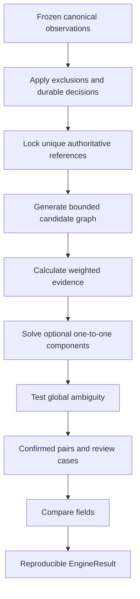

# Reconciliation Algorithm

## 1. Objective

The matcher is an explainable deterministic pipeline that produces a partial one-to-one mapping between eligible records. It can abstain when evidence is ambiguous or incomplete.

```text
reconcile(snapshot, matching_policy, comparison_policy, decisions)
    -> EngineResult
```

The engine performs no database queries, file access, clock reads, or network calls.

## 2. Pipeline



## 3. Stage 1: eligibility and human authority

- Use only observations in the frozen dataset memberships.
- Retain cancelled rows as excluded evidence.
- Apply active manual links first and reserve both endpoints.
- Reserve accepted-unmatched identities from matching.
- Remove actively rejected relationships from every automatic stage.
- If a decision's partner is absent or cancelled, preserve the decision and flag the eligible endpoint for attention.

After normal assignment, a separate read-only diagnostic search checks accepted-unmatched and changed-decision identities for plausible new evidence. It can create alerts but cannot release a reservation or affect assignment.

## 4. Stage 2: authoritative reference matching

A configured cross-source reference establishes identity when:

- The reference namespace is explicitly trusted by both source contracts.
- The reference occurs exactly once on each side within the run scope.
- No active rejection prohibits that relationship.
- Neither endpoint is reserved by another decision.

Reference matching uses hash indexes and takes expected `O(n + m)` work.

Reference identity does not imply value agreement. A pair remains authoritative if amount, currency, direction, instrument, or timestamp differs; comparison exposes those discrepancies.

Duplicate trusted references form an ambiguity case.

Reference semantics are versioned:

- `SHARED_MUST_AGREE`: two present unequal references prohibit heuristic automatic pairing.
- `SOURCE_LOCAL_OR_ALIAS`: source IDs may differ; only mapped shared aliases provide authoritative evidence.
- A missing reference is missing evidence, not automatically a contradiction.

## 5. Stage 3: candidate generation

Candidate generation reduces work; it does not establish identity. Union several strict blocking passes so a true pair missed by one pass can enter through another.

Initial candidate conditions:

- Same reconciliation book/account scope.
- Compatible instrument, side, and currency for heuristic automation.
- Timestamp within a broad configured window.
- Optional secondary-reference or broad-quantity pass.

Manual search can include incompatible records with explicit warnings.

Three thresholds remain distinct:

| Threshold | Purpose | Illustrative demo value |
|---|---|---:|
| Candidate search window | Decide whether to examine a pair | 24 hours |
| Similarity band | Determine score decay | 10 minutes for time |
| Comparison tolerance | Decide if linked values agree | 60 seconds |

The complete eligible edge set is retained for each solved component. Taking only each record's top candidates before solving can create false certainty.

## 6. Stage 4: weighted evidence

Initial weights are hypotheses to evaluate:

| Feature | Weight | Broad similarity band |
|---|---:|---|
| Quantity | 35 | max(asset absolute band, 1% of larger value) |
| Timestamp | 25 | 600 seconds |
| Unit price | 15 | max(currency absolute band, 1% of larger value) |
| Gross amount | 25 | max(currency absolute band, 1% of larger value) |

For numeric difference `d` and broad band `b`:

```text
feature = max(0, 1 - d / b)
if b == 0: feature = 1 for equality, else 0
score = sum(weight * feature)
```

Missing features contribute zero. Weights are not renormalized over available fields, because one agreeing field must not become a perfect score. Required evidence coverage is a separate automatic-acceptance condition.

All feature evidence is retained: raw and normalized values, difference, band, contribution, missingness, blocking reasons, and contradictions.

Decimal arithmetic is quantized with `ROUND_HALF_EVEN` to solver basis points:

```text
score_bp = round_half_even(score_0_to_100 * 100)
assignment_floor_bp = 7000
automatic_threshold_bp = 9000
global_margin_bp = 800
```

The UI divides by 100 for a score on a 0–100 scale. It never labels this heuristic number as a probability.

## 7. Stage 5: optional-unmatched global assignment

Partition the candidate graph into connected components. Within a component maximize:

```text
utility(edge) = score_bp(edge) - assignment_floor_bp
objective = sum(utility(edge) for selected edges)
unmatched utility = 0
```

Subject to each left and right record appearing in at most one selected edge.

For `n` left and `m` right nodes, construct an `n × (m+n)` cost matrix:

- Eligible real edge cost: `-utility(edge)`.
- Missing or forbidden real edge: safe positive forbidden cost.
- `n` dummy columns: zero cost.

Each left node can select a dummy. Unused right columns remain unmatched. Validate every returned real edge against the eligibility set.

The design uses SciPy's linear assignment solver. Current SciPy documentation describes a modified Jonker–Volgenant implementation; the design should call it a linear assignment solver rather than incorrectly calling the implementation Hungarian. [SciPy documentation](https://docs.scipy.org/doc/scipy-1.13.0/reference/generated/scipy.optimize.linear_sum_assignment.html)

## 8. Stage 6: global ambiguity gate

An optimal mathematical assignment is not automatically reliable. Let `W*` be the optimal component utility. For each proposed real edge `e`:

1. Forbid only `e`.
2. Re-solve the same complete component with every other edge and unmatched option.
3. Calculate `gap(e) = W* - W*without(e)`.

Automatically confirm the edge only if:

- `score_bp >= 9000`.
- Required evidence coverage is satisfied.
- No hard contradiction applies.
- `gap >= 800`.
- Candidate enumeration and sensitivity analysis completed within limits.

A tied optimum gives gap zero and therefore abstains. Stable IDs can order output but cannot create evidential certainty.

Do not require mutual-local-best as another gate. A globally beneficial pairing may deliberately use one record's second-highest local edge. Local alternatives remain explanation, not authority.

After the gate, retain the accepted subset and return all remaining records for review. Do not iteratively remove alternatives and rerun greedy acceptance; doing so can make weak edges appear certain.

## 9. Greedy failure example

| Score | R1 | R2 |
|---|---:|---:|
| L1 | 94 | 92 |
| L2 | 93 | 20 |

With a floor of 70:

- Greedy selects L1–R1 for utility 24 and leaves L2 unmatched.
- Global assignment selects L1–R2 and L2–R1 for utility `22 + 23 = 45`.
- Forbidding either selected global edge leaves best utility 24.
- Each selected edge has global gap 21 and exceeds the automatic score threshold.

If all four scores are 94, both complete assignments have equal utility. Each gap is zero, so the component remains ambiguous.

The figures illustrate algorithm behavior. They do not represent measured financial accuracy.

## 10. Component limits

Initial limits, subject to benchmarks:

- 100 total real nodes per solved component.
- 2,500 eligible edges per component.
- 250,000 candidate edges per run.
- 200 enumerated candidates per record.

Sensitivity analysis requires one base solution plus one solution per proposed edge.

If a complete component exceeds a limit, create `REVIEW_REQUIRED / COMPONENT_LIMIT`. If enumeration truncates before component boundaries are known, withhold heuristic automatic matching for that blocking partition. Do not compute a strong-looking margin from an incomplete graph.

## 11. Field comparison

Comparison occurs after pairing, regardless of pair origin.

| Field | Comparison |
|---|---|
| Instrument, side, currency | Canonical equality |
| Timestamp | Absolute elapsed duration with inclusive tolerance |
| Quantity, unit price, gross amount | Explicit decimal absolute/relative tolerance |
| State | Versioned compatibility matrix |
| Reference | Equality/difference and the reference's matching role |

Numeric rule:

```text
signed_difference = right - left
allowed = max(abs_tolerance, rel_tolerance * max(abs(left), abs(right)))
passes = abs(signed_difference) <= allowed
```

Different currencies produce a currency mismatch and `NOT_COMPARABLE` amount result. The system does not subtract unlike currencies.

The demo policy starts with 0.05 USD gross-amount tolerance, 0.01 USD price tolerance, 0.00000001 quantity tolerance, and 60-second time tolerance. These are demonstrative configuration values, not financial standards.

## 12. Output classification

Output keeps independent dimensions:

- Pair origin: `MANUAL`, `AUTHORITATIVE_REFERENCE`, `WEIGHTED_GLOBAL`, `NONE`.
- Comparison: `EXACT`, `WITHIN_TOLERANCE`, `DISCREPANT`, `NOT_COMPARABLE`, `NOT_APPLICABLE`.
- Review: `OPEN`, `ACCEPTED_UNMATCHED`, `PENDING_RERUN`, `REQUIRES_ATTENTION`, `CLOSED`.

Explanations state observed facts, such as “gross amount differs by 170.00.” They do not infer fees, fraud, or settlement intent without structured source evidence.

## 13. Determinism requirements

- Sort records and edges by stable logical identities before component construction.
- Store engine, policy, and solver versions.
- Use exact decimal feature calculations and integer solver costs.
- Hash the complete candidate graph and policy inputs.
- Ensure CSV row ordering cannot change the result.
- Keep tie-breaking limited to stable display order.

## 14. Evaluation requirements

Compare exact-only, greedy-weighted, and weighted-global-with-abstention strategies on the same labelled synthetic datasets.

Automatic precision/recall includes only authoritative and weighted-global outputs. Manual links never inflate automatic metrics; manually reserved records are excluded from automatic eligibility. Report workflow coverage including manual resolutions separately.

Candidate recall measures whether true pairs eligible for the heuristic stage entered the candidate graph. This isolates blocking failures from assignment failures.

Required algorithm fixtures include the greedy counterexample, equal optima, near-margin cases, unequal side sizes, weak edges selecting unmatched, duplicate references, missing features, corrected evidence, and component limits. Tiny graphs are also solved exhaustively to verify the solver objective.
