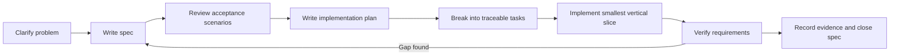

# Spec-Driven Development

This directory controls how the Reconciliation Workbench is built. Design documents explain the system as a whole; feature specifications define observable behavior that implementation and tests must satisfy.

## Required lifecycle



Each feature directory contains:

| File | Purpose | Created when |
|---|---|---|
| `spec.md` | User-visible behavior, requirements, invariants, acceptance scenarios, exclusions | Before implementation |
| `plan.md` | Technical approach, affected modules/data, migrations, risks, rollout | After spec review |
| `tasks.md` | Ordered, independently verifiable work items mapped to requirements | After plan review |
| `verification.md` | Test results, measurements, screenshots/links, remaining limitations | During and after implementation |

Templates live in [`_templates`](./_templates). The project-wide non-negotiable rules are in the [constitution](./constitution.md), feature order is in the [roadmap](./roadmap.md), and recorded audits are in [`reviews`](./reviews/).

## Status model

Every `spec.md` starts with exactly one status:

- `Draft` — problem and requirements are being shaped.
- `Ready` — behavior is testable and open decisions are resolved.
- `In progress` — approved tasks are being implemented.
- `Verified` — acceptance scenarios pass and evidence is recorded.
- `Deferred` — intentionally postponed with a reason.
- `Superseded` — replaced by another named specification.

Moving to `Ready`, `In progress`, or `Verified` requires updating the spec header and history.

## Traceability

Requirement IDs use a stable feature prefix:

| Feature | Prefix |
|---|---|
| Foundation and anonymous workspace | `FND` |
| Source mapping and ingestion | `ING` |
| Reconciliation engine | `REC` |
| Decisions and stable cases | `REV` |
| Workbench and history UI | `UX` |
| Jobs, operations, and deployment | `OPS` |
| Local-only storage simplification | `STO` |

Examples:

```text
Requirement: REC-014
Acceptance scenario: REC-A07
Task: REC-T23
Test: test_rec_014_tied_assignment_abstains
Commit: feat(REC-014): abstain on equal global assignments
```

IDs are never reused after publication. Removed behavior remains in history and is marked superseded or withdrawn.

Prefixes contain two to four uppercase letters. Requirements use `<PREFIX>-NNN`, scenarios use `<PREFIX>-ANN`, and tasks use `<PREFIX>-TNN`. A requirement ID appears exactly once as a definition, although traceability tables may reference it repeatedly.

## Spec review checklist

A feature can become `Ready` only when:

- The user/problem and desired outcome are clear.
- Every independently testable behavior has a stable requirement ID. Supporting prose and invariants cite the requirements they refine or a constitutional principle; they cannot introduce an untraceable contract.
- Acceptance scenarios use concrete inputs and observable outcomes.
- Error, empty, retry, and concurrency behavior are defined where relevant.
- Privacy and workspace-isolation effects are stated.
- Data retention and historical behavior are stated.
- Out-of-scope behavior is explicit.
- Dependencies on other specs and design decisions are named.
- No unresolved question changes the public contract or data model.
- Terms match the shared domain glossary.
- The requirement-to-scenario matrix covers every requirement and every scenario.
- The change history explains why the current status is justified.

## Plan review checklist

- Every requirement is mapped to at least one component and verification method.
- Schema changes include migration and rollback/recovery reasoning.
- Concurrency boundaries and transaction scope are explicit.
- New background work defines idempotency, retries, leases, and publication.
- Performance-sensitive work defines a benchmark or capacity target.
- The implementation keeps the domain engine independent of Django.
- Rejected approaches and meaningful tradeoffs are recorded in an ADR or the plan.

## Task rules

- Tasks are ordered by dependency and produce reviewable increments.
- Each task cites requirement and acceptance IDs.
- Tests that prove behavior are part of the task, not a later cleanup phase.
- A task is complete only when its named verification passes.
- Unexpected behavior pauses the affected task and updates the spec or plan first.
- Unrelated cleanup is tracked separately rather than hidden inside a feature commit.

## Definition of Done

A feature is `Verified` only when:

- All required acceptance scenarios pass.
- Requirement-to-test traceability contains no gaps.
- Relevant unit, integration, property, browser, security, and performance checks pass.
- Migrations and operational behavior were exercised where applicable.
- User-facing errors and accessibility behavior were reviewed.
- Documentation and sample/demo data reflect actual behavior.
- `verification.md` records commands, results, measurements, and known limitations.
- No claim in the README or demo exceeds the collected evidence.

## Change control

If implementation reveals a new requirement or invalid assumption:

1. Stop the affected implementation path.
2. Update the spec and its change history.
3. Update the plan and ADR when architecture changes.
4. Re-map tasks and tests.
5. Resume implementation after the behavioral contract is coherent.

Bug fixes begin with a failing acceptance example linked to an existing requirement or a new requirement clarifying the missing behavior.

## Git conventions

- Feature branches: `codex/<spec-number>-<short-name>`.
- Commits include a requirement or task ID when they implement behavior.
- Spec/plan commits precede implementation commits for substantial features.
- Keep commits reviewable: specification, domain behavior, persistence, UI, and verification may be separate commits.
- Do not rewrite verified historical specifications to hide earlier decisions; append a change entry or supersede them.

## Relationship to design documents

- `docs/01-product-design.md` defines the overall user experience.
- `docs/02-hld.md` defines system boundaries.
- `docs/03-lld.md` defines current detailed architecture.
- `docs/04-reconciliation-algorithm.md` defines the algorithm baseline.
- `docs/05-architecture-decisions.md` explains selected and rejected approaches.
- `docs/06-verification-and-delivery.md` defines project-level evidence.

Feature specs may narrow or detail these documents, but may not silently contradict them. A contradiction requires an explicit ADR and synchronized document update.
